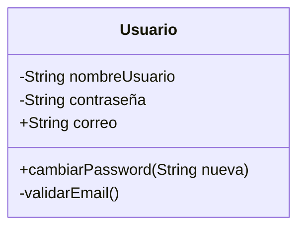
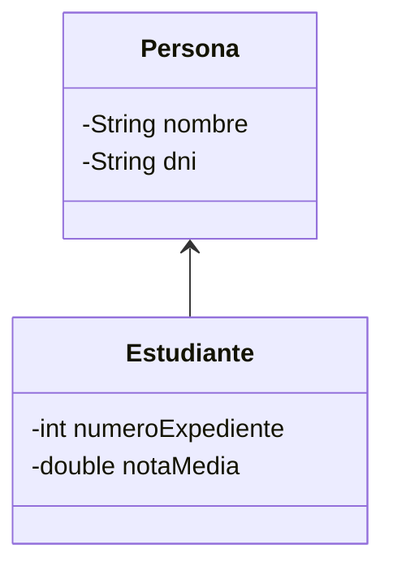
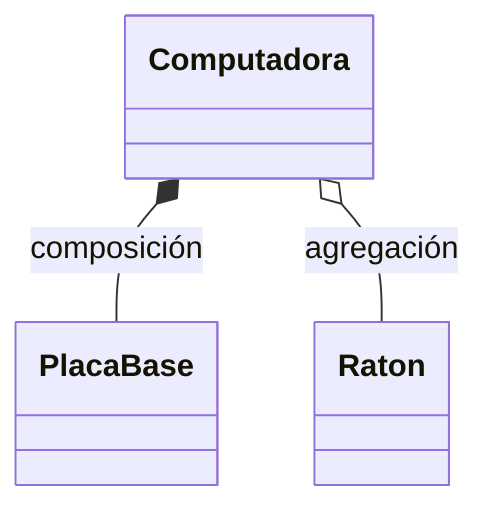
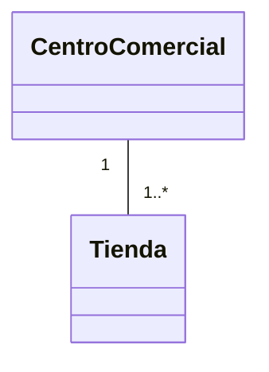
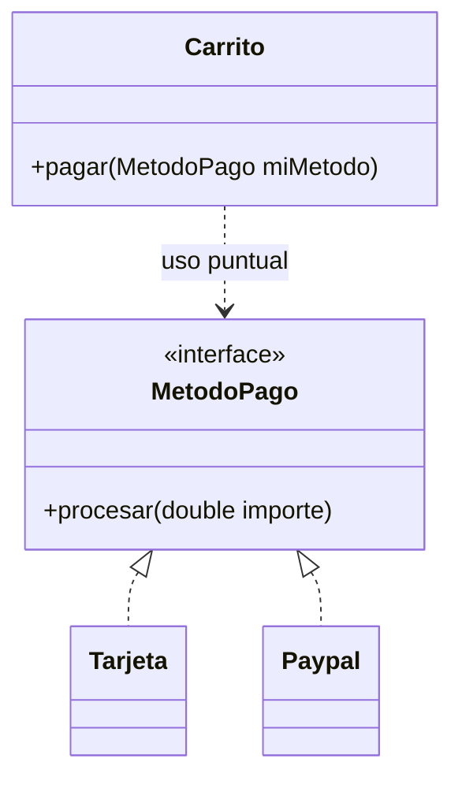
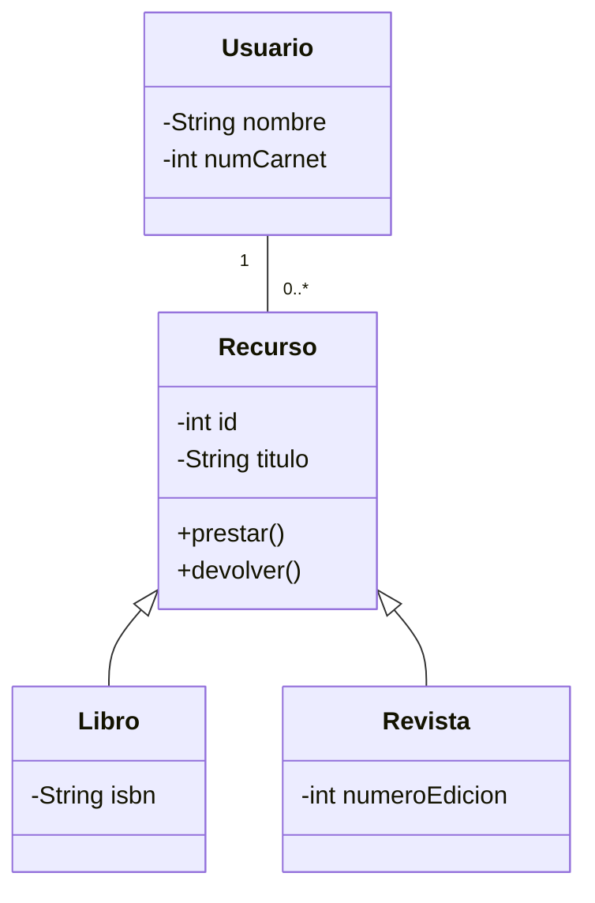

# 6.2 Batería de ejercicios UML

## Ejercicio 1 – Usuario de plataforma de streaming

### 1. Enunciado
Se debe diseñar una clase que represente a un usuario de una plataforma de streaming, aplicando encapsulación para proteger los datos sensibles.

### 2. Clases
- Usuario

## 3. Diseño UML
La clase Usuario contiene atributos privados para el nombre de usuario y la contraseña.
El correo electrónico es público.
El método cambiarPassword es público, mientras que validarEmail es privado porque es un método interno de validación.

### 4. Diagrama de clases (Mermaid)

## Ejercicio 2 – Persona y Estudiante

### 1. Enunciado
En un sistema escolar se modelan Personas y Estudiantes.  
Un Estudiante es una Persona, pero además posee información académica adicional.

### 2. Clases
- Persona
- Estudiante

### 3. Diseño UML
La clase Persona actúa como clase base y contiene los atributos comunes a cualquier persona: nombre y DNI.  
La clase Estudiante hereda de Persona y añade sus propios atributos: número de expediente y nota media.  

No se repiten los atributos heredados en la clase Estudiante, ya que estos provienen de la clase padre.

### 4. Diagrama de clases (Mermaid)

## Ejercicio 3 – Computadora, PlacaBase y Ratón

### 1. Enunciado
Se debe modelar una Computadora y sus componentes, diferenciando entre relaciones de composición y agregación.

### 2. Clases
- Computadora
- PlacaBase
- Raton

### 3. Diseño UML
La Computadora tiene una relación de composición con la PlacaBase, ya que esta no puede existir de forma independiente: si la computadora se destruye, la placa base también.

Por otro lado, la Computadora tiene una relación de agregación con el Ratón, ya que el ratón puede existir y utilizarse de forma independiente aunque la computadora deje de existir.

### 4. Diagrama de clases (Mermaid)

## Ejercicio 4 – Centro Comercial y Tiendas

### 1. Enunciado
Se debe modelar un Centro Comercial que alberga varias tiendas, teniendo en cuenta la pertenencia de cada tienda a un único centro.

### 2. Clases
- CentroComercial
- Tienda

### 3. Diseño UML
Un CentroComercial puede albergar una o varias tiendas.
Cada Tienda pertenece obligatoriamente a un único CentroComercial.

La relación se representa mediante una asociación con multiplicidades, indicando que un centro tiene de 1 a muchas tiendas, mientras que cada tienda está asociada a un solo centro.

### 4. Diagrama de clases (Mermaid)

## Ejercicio 5 – Sistema de pagos

### 1. Enunciado
Se debe diseñar un sistema de pagos flexible que permita utilizar distintos métodos de pago sin modificar la lógica del carrito.

### 2. Clases e interfaces
- MetodoPago (interfaz)
- Tarjeta
- Paypal
- Carrito

### 3. Diseño UML
La interfaz MetodoPago define el contrato que deben cumplir todos los métodos de pago mediante el método procesar(double importe).

Las clases Tarjeta y Paypal implementan la interfaz MetodoPago, proporcionando su propia forma de procesar el pago.

La clase Carrito no depende de una implementación concreta, sino que utiliza la interfaz MetodoPago de forma puntual en su método pagar, permitiendo aplicar polimorfismo.

### 4. Diagrama de clases (Mermaid)

## Ejercicio 6 – Sistema de Gestión de Biblioteca Universitaria

### 1. Enunciado
Se debe diseñar un sistema básico para gestionar los recursos de una biblioteca universitaria y los préstamos realizados a los usuarios.

### 2. Clases
- Recurso
- Libro
- Revista
- Usuario

### 3. Diseño UML
La clase Recurso actúa como clase padre y representa cualquier elemento prestable de la biblioteca.  
Contiene atributos privados comunes y métodos públicos para gestionar el préstamo y la devolución.

Las clases Libro y Revista heredan de Recurso y añaden atributos específicos propios de cada tipo de recurso.

La clase Usuario representa a las personas que pueden realizar préstamos.  
Un usuario puede tener prestados uno o varios recursos al mismo tiempo.

La relación entre Usuario y Recurso es una asociación con multiplicidad de uno a muchos (1 a 0..*).

### 4. Diagrama de clases (Mermaid)

