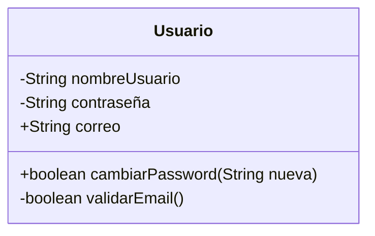
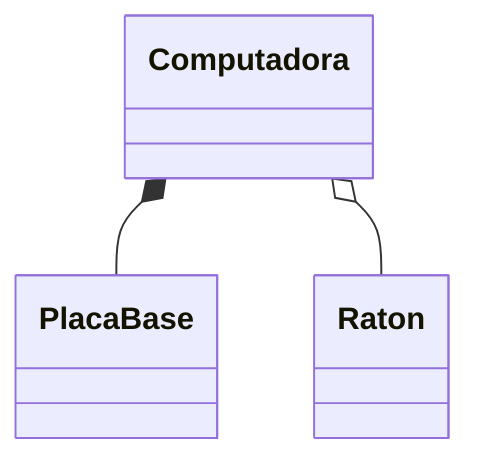
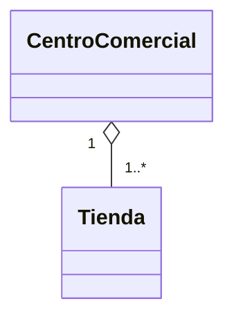
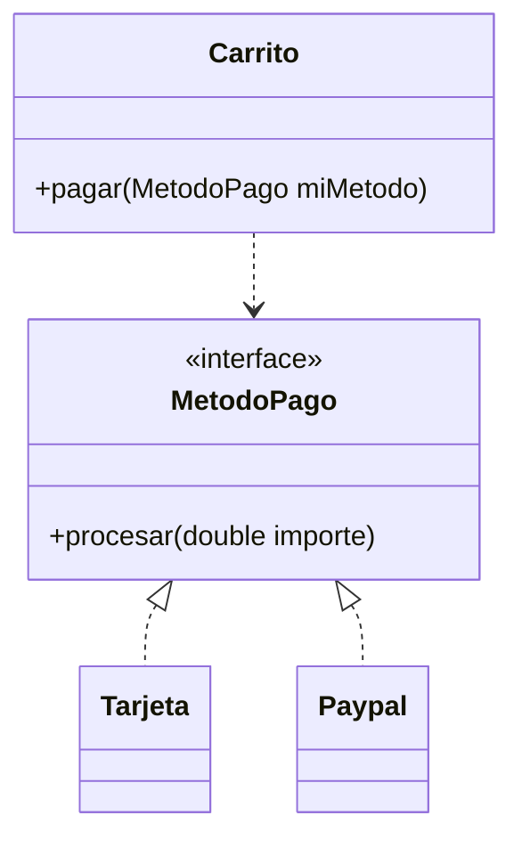
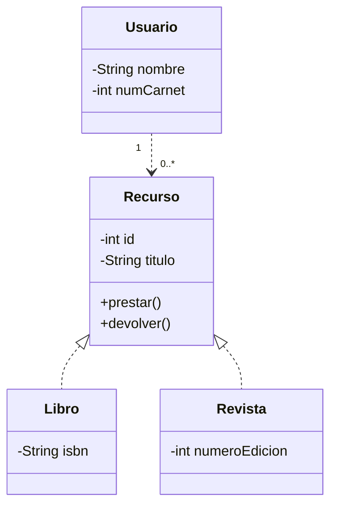

# 6.2 Batería de ejercicios UML

## Ejercicio 1 – Usuario de plataforma de streaming

### 1. Enunciado
Se debe diseñar una clase que represente a un usuario de una plataforma de streaming, aplicando encapsulación para proteger los datos sensibles.

### 2. Clases
- Usuario

## 3. Diseño UML
La clase Usuario contiene atributos privados para el nombre de usuario y la contraseña.
El correo electrónico es público.
El método cambiarPassword es público y devuelve un valor booleano que indica si el cambio se ha realizado correctamente.
El método validarEmail es privado y devuelve un valor booleano, ya que se trata de una validación interna.

### 4. Diagrama de clases (Mermaid)

## Ejercicio 2 – Persona y Estudiante

### 1. Enunciado
En un sistema escolar se modelan Personas y Estudiantes.  
Un Estudiante es una Persona, pero además posee información académica adicional.

### 2. Clases
- Persona
- Estudiante

### 3. Diseño UML
La clase Persona actúa como clase base y contiene los atributos comunes a cualquier persona: nombre y DNI.
La clase Estudiante hereda de Persona y añade sus propios atributos: número de expediente y nota media.

No se repiten los atributos heredados en la clase Estudiante, ya que estos provienen de la clase padre.

### 4. Diagrama de clases (Mermaid)

## Ejercicio 3 – Computadora, PlacaBase y Ratón

### 1. Enunciado
Se debe modelar una Computadora y sus componentes, diferenciando entre relaciones de composición y agregación.

### 2. Clases
- Computadora
- PlacaBase
- Raton

### 3. Diseño UML
La Computadora tiene una relación de composición con la PlacaBase, ya que esta no puede existir de forma independiente.

La relación entre Computadora y Ratón es de agregación, ya que el ratón puede existir independientemente del ciclo de vida de la computadora.

### 4. Diagrama de clases (Mermaid)

## Ejercicio 4 – Centro Comercial y Tiendas

### 1. Enunciado
Se debe modelar un Centro Comercial que alberga varias tiendas, teniendo en cuenta la pertenencia de cada tienda a un único centro.

### 2. Clases
- CentroComercial
- Tienda

### 3. Diseño UML
Un CentroComercial puede albergar una o varias tiendas.
Cada Tienda pertenece obligatoriamente a un único CentroComercial.

La relación se modela como una agregación, ya que las tiendas pueden existir independientemente del centro comercial.

### 4. Diagrama de clases (Mermaid)

## Ejercicio 5 – Sistema de pagos

### 1. Enunciado
Se debe diseñar un sistema de pagos flexible que permita utilizar distintos métodos de pago sin modificar la lógica del carrito.

### 2. Clases e interfaces
- MetodoPago (interfaz)
- Tarjeta
- Paypal
- Carrito

### 3. Diseño UML
La interfaz MetodoPago define el contrato común mediante el método procesar(double importe).

Las clases Tarjeta y Paypal realizan la interfaz MetodoPago.

La clase Carrito utiliza un método de pago de forma puntual, estableciendo una relación de dependencia, lo que permite aplicar polimorfismo.

### 4. Diagrama de clases (Mermaid)

## Ejercicio 6 – Sistema de Gestión de Biblioteca Universitaria

### 1. Enunciado
Se debe diseñar un sistema básico para gestionar los recursos de una biblioteca universitaria y los préstamos realizados a los usuarios.

### 2. Clases
- Recurso
- Libro
- Revista
- Usuario

### 3. Diseño UML
La clase Recurso actúa como clase base y representa cualquier elemento prestable.

Libro y Revista heredan de Recurso y añaden atributos propios.

La clase Usuario representa a las personas que pueden realizar préstamos.
Un usuario puede utilizar uno o varios recursos en un momento dado.

La relación entre Usuario y Recurso se modela como una dependencia, ya que el uso de los recursos es puntual (préstamo).

### 4. Diagrama de clases (Mermaid)

